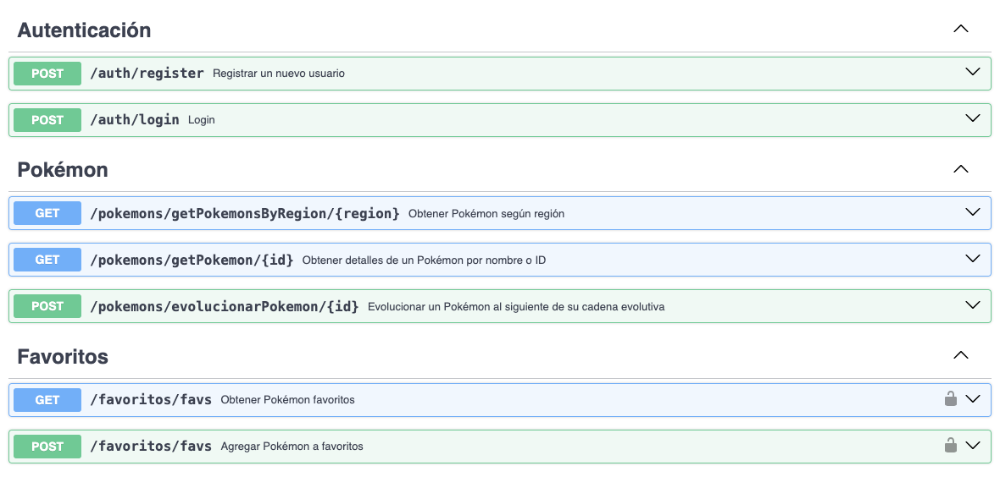

# 🎮 Pokédex Mobile

Este proyecto es una aplicación móvil con las funcionalidades:

- 🧾 Registrar usuarios y autenticarlos con JWT
- ⭐ Guardar Pokémon favoritos por usuario
- 🌍 Consultar Pokémon por región

## 🚀 Tecnologías Utilizadas

| Capa         | Tecnología         | Descripción breve                                                             |
|--------------|--------------------|-------------------------------------------------------------------------------|
| Backend      | FastAPI            | Framework web moderno y rápido para construir APIs con Python.               |
| Documentación| Swagger UI         | Generada automáticamente por FastAPI para probar y documentar endpoints.     |
| Base de datos| SQLite             | Base de datos ligera usada para persistencia local durante el desarrollo.    |
| ORM          | SQLAlchemy         | Mapeo objeto-relacional para interactuar con la base de datos desde Python.  |
| Autenticación| JWT (JSON Web Token)| Método de autenticación basado en tokens para proteger rutas del backend.    |
| Frontend| Fluter | Método de autenticación basado en tokens para proteger rutas del backend.    |


## 🧱 Arquitectura

-----
Para cada ruta, se utilizó la arquitectura Backend For Frontend.

## 🔐 Autenticación
Este backend usa JWT (JSON Web Tokens) para proteger los endpoints.
Debes registrarte (/auth/register) y luego iniciar sesión (/auth/login) para obtener el token.

## 🧪 Base de Datos
Se usa SQLite como base de datos local para pruebas.
Los modelos están definidos con SQLAlchemy ORM.


## 🛠️ Configuración del entorno y ejecución del servidor back-end

1. Clonar el repositorio
```
git clone https://github.com/vivz-dev/poke-app
cd poke-app
```

2. Elimina el entorno virtual anterior (si existe)
```
rm -rf .venv
```

3. Crea un nuevo entorno virtual
```
python3 -m venv .venv
```

4. Activa el entorno virtual
```
source .venv/bin/activate
```

5. Actualiza pip e instala dependencias
```
pip install -r requirements.txt
```

6. Inicia el servidor FastAPI (desde el directorio back)
```
cd back && uvicorn main:app --reload
```

7. Opcional: Leer documentación de rutas
Una vez levantado el servidor backend, se puede leer la documentación de cada ruta disponible en:
```
http://127.0.0.1:8000/docs#/
```

